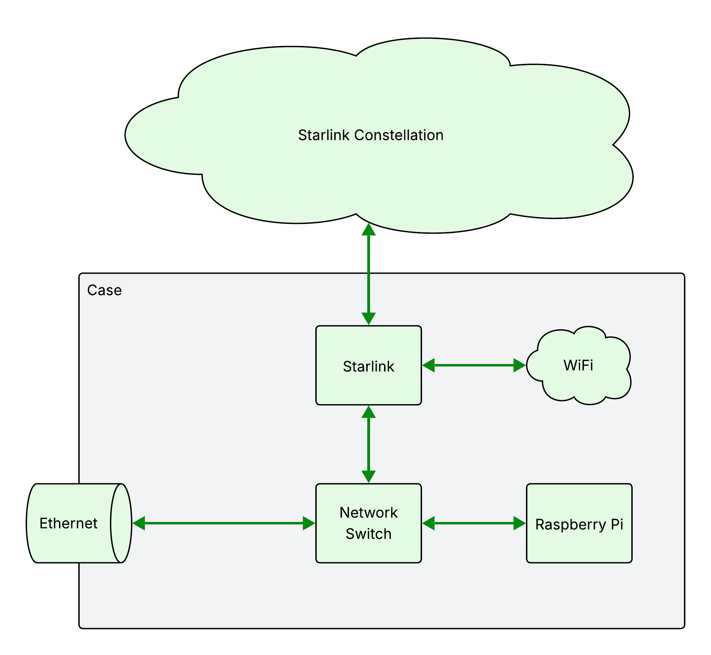

After the Verizon outage in Jan of 2026, I wanted a backup internet connection
that I could put in a car or take with me if I needed. So I built this.

Meet Campfyre. It's a battery powered and ruggedized network-in-a-box. Campfyre
can run completely off-grid with Starlink, providing internet access when you
need it most. Campfyre can also be charged from a car's 12V system, and is
sealed to prevent water damage. It's easy to build and requires only simple
tools to assemble. So how does it work? Let's get into it.

The main feature of Campfyre is centered around a Starlink Mini. The Starlink
Mini hosts a WiFi hotspot and has an Ethernet port, which is then connected to a
network switch. Because Starlink acts as a router, any device connected to the
switch can talk to the Internet, including a device connected to the external
Ethernet jack on Campfyre. In theory, an entire building could receive its
internet access through Campfyre (though speeds would be limited by how fast
Starlink can transmit and receive data).

Next, let's talk about how it's powered. Campfyre has two primary input
sources - external DC, and the internal LiFePO4 battery. It then has a shared
power bus, called VBUS, where the main power supplies connect to and draw from.
It feeds the Raspberry Pi (via a 5V power supply), the Starlink dish, and the
network switch. Campfyre can run for approximately two hours under heavy usage,
or up to four and a half hours maximum.

To generate VBUS, external power and the battery connect to what is called a
power path controller that selects which input to use to supply the downstream
devices, giving priority to external power. This means that when Campfyre is
plugged in, it will charge the battery while keeping Starlink, the network
switch, and the Raspberry Pi online. The power path controller feeds into a 12V
regulating power supply. That then feeds directly to the Starlink and the
network switch, and into a secondary power supply for the Raspberry Pi.

break to image of Campfyre

The last important feature is the case in which everything is built. It's a
standard, off-the-shelf camera case with a waterproof seal and pressure
equalization valve. This means that Campfyre should be safe in the rain, though
submerging it in water is not recommended. The case is made of radio-transparent
polypropylene, so Starlink can communicate efficiently through the lid of the
case, as long as it has a clear view of the sky.

Campfyre is a ruggedized network-in-a-box for camping, traveling, or just a
backup internet connection if your home internet goes out. In the next video,
you'll learn how to build your own Campfyre, where to get the parts, and what to
expect from the process.
